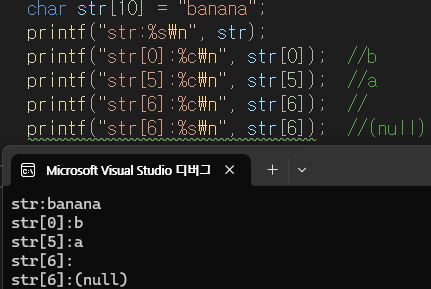
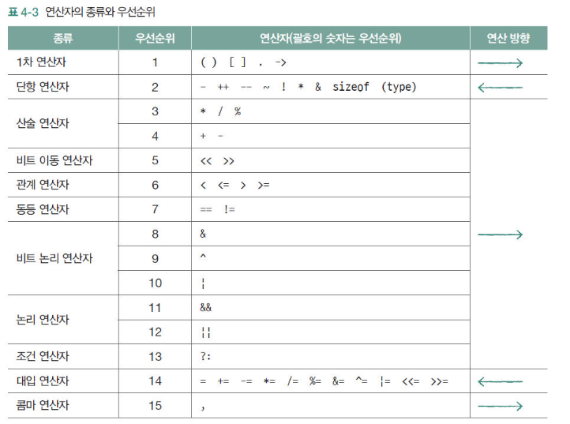
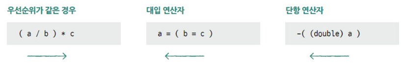
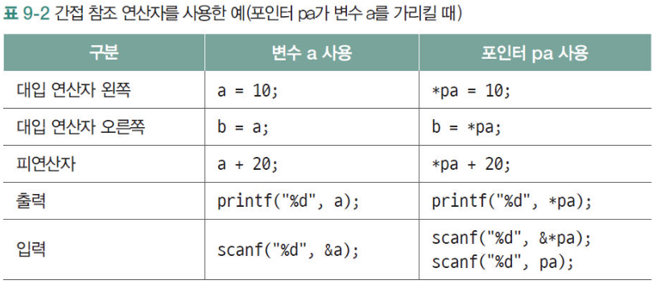
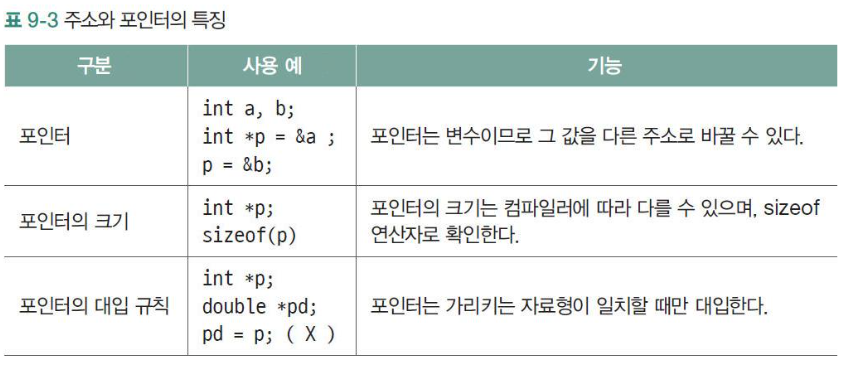
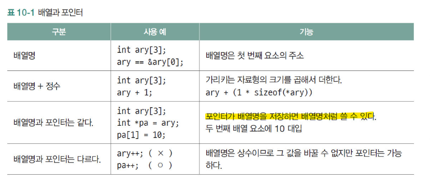
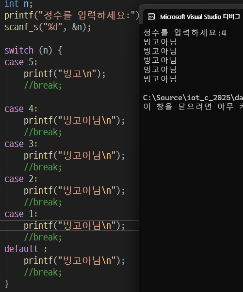
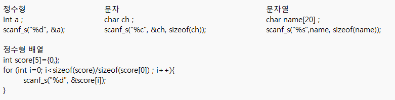
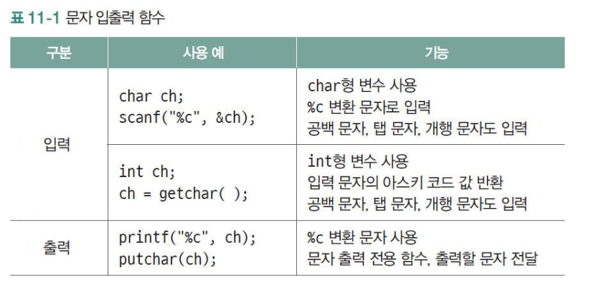

# iot_c_2025
## c언어 기초
- 01 프로그램 만들기
    - 소스파일 컴파일
        - 빌드-솔루션빌드
        - `ctrl + shift + B`
    - 실행파일 실행
        - 디버그-디버그하지 않고 시작
        - `ctrl + F5`

    - visual stdio 2019에서 scanf, gets, strcpy 등 함수 사용불가
        - **#define _CRT_SECURE_NO_WARNINGS** 제일 위에 정의

- 02 상수와 데이터 출력
    - 프로그램과 main함수 구조
        - main함수 - 프로그램이 시작되는 곳으로 필수 함수
        - 머리 
       ```c
        int main(void)
        ```
        - 몸통 
        ```c
        {return 0; }
        ``` 
    - 데이터 출력 방법
        - 제어문자 출력
            - \n 줄바꿈 
            - \t 탭 위치로 이동
            - \r 맨 앞으로 이동
            - \b 한 칸 왼쪽으로 이동
        ```c
        #inclde <stdio.h>
        int main(void){
            printf("Be Happy/n");    
            printf("Goot\bd\tchance\n");   // Good  chance
            return 0;
        }
        ```
        - 정수와 실수 출력  [C](./day01/printf.c)
            - %lf 소수점이하 6자리까지 출력
            - %.1lf 소수점이하 1자리까지 출력함수
        ```c
        #inclde <stdio.h>
        int main(void){
            printf("%d과 %d의 합은 %d입니다.\n" , 10,20,10+20);
            printf("%.1lf- %.1f = %.1lf\n" , 3.4,1.2,3.4-1.2);
            return 0;
        }
        ```    
    - 상수와 데이터 표현 방법 
        - 정수 상수 표현법  [C](./day01/printf2.c)
            - 10진수(0~9)
            - 8진수 (0~7)
            - 16진수 (0~9 + A~F) 4바이트(nibble)
            ```c
            #inclde <stdio.h>
            int main(void){
                // 10진수 12 = 8진수 014 = 16진수 0xc
                printf("%d\n",12);          //10진수 정수 상수 출력
                printf("%d\n" , 014);       //8진수 정수 상수 출력
                printf("%d\n" , 0xc);       //16진수 정수 상수 출력
                return 0;
            }
            ```  
        - 실수 상수 표현법
            - 정규화 - 소수점 앞에 0이 아닌 한 자리만을 사용한 지수
            ```c
            #inclde <stdio.h>
            int main(void){
                printf("%.1lf\n",1e6);          //1000000.0
                printf("%.7lf\n" , 3.14e-5);       //0.0000314
                printf("%le\n" , 0.0000314);       //3.140000e-05
                printf("%.2le\n" , 0.0000314);       //3.14e-05
                return 0;   
            }
            ```  
        - 문자와 문자열 상수표현법 [C](./day01/printf3.c)
            - `"%c"  -문자 ''`
            - `"%s"  -문자열 ""`

        - 상수가 컴파일 된 후의 데이터 크기
            - 정수는 4바이트 (예) 10 = 00000000  00000000  00000000 00001010
            - 실수는 8바이트 (부호비트 1 + 지수 11비트 + 소수 52비트)
            - 음수는 2의 보수(1의 보수 +1 /1의 보수는 0은 1로 , 1은 0으로)
            ```c
            // 10.0 실수상수를 8바이트로 변환
            // 10.0 = 1010.0 = 1.010 * 2의 3승
            // 가수 1.010
            // 지수 3
            // 부호비트 1비트 양수이므로 0 (음수일 때는 1)   =>0    (1비트)
            // 8바이트는  지수는 편향값 1023을 사용하므로 지수는 1026 => 10000000010 (11비트)
            // 가수는 64-12 = 52비트를 채워야 함. 010 + 0으로 49비트
            //0 10000000010 0100000000000000000000000000000000000000000000000000
            ```
- 03 변수와 데이터 입력 중 변수 [C](./day01/value.c)
    - **const를 사용한 변수는 초깃값 수정 불가/상수처럼 사용할 수 있음**  [C](./day01/value6.c)
    - 정수 자료형
        - **char 1바이트**
        - short 2바이트
        - int 4바이트
        - long 4바이트
        - long long 8바이트
    ```c
    #inclde <stdio.h>
    int main (void){
        char ch1 = 'A';
        char ch2 = 65;
        printf("문자 %c의 아스키 코드 값: %d\n" , ch1, ch1);
        printf("아스키 코드 값이 %d인 문자 : %c\n" , ch2, ch2);
        return 0;
    }
    ```
    - unsigned정수 자료형 [C](./day01/value2.c)
        - 양수만 저장
        - "%u"
    ```c
    // unsigned를 잘못 사용한 경우
    #inclde <stdio.h>
    int main (void){
        unsigned int a;
        a = 4294967295;
        printf("%d\n", a);
        a = -1 ;
        printf("%u\n", a);
        return 0;
        //%d는 부호가 있으므로  4294967295 ->   1 1111111 11111111 11111111 11111111 -> 음수는 2의보수를 쓰면 1 0000000 00000000 00000000 00000001  ->-1
        //%u는 부호가 무시하므로 -1 -> 2의 보수쓰면 11111111 11111111 11111111 11111111 -> 4294967295 
    }
    ```
    - 실수 자료형 
        - `유효 숫자가 많을 수록 더 정확한 값을 표현할 수 있다.`
        - **C에서 자료형이 정해지지 않은 리터럴 3.1과 4.7은 기본적으로 double 타입으로 취급됩니다.**
        - float 4바이트 , %f
        - double 8바이트 , %lf
        - long double 8바이트 이상  , %Lf
        ```c
        #include <stdio.h>
        int main (void){
            float ft = 1.234567890123456789;
            double db = 1.234567890123456789;
            printf("%.20f\n",ft);  //1.23456788063049316406
            printf("%.20lf\n",db); //1.23456789012345669043
            return 0;
        }
        ```
    - 문자열 저장
        - **문자열은 char 배열에 저장**
        - **배열의 크기는 \0 널문자를 위해 1이상 크게 확보**
        ```C
        #include <stdio.h>
        int main(void){
            char fruit[6]="apple";
            printf("%s" , fruit);
            return 0 ;
        }
        ```
        

        - string.h 헤더파일
            - strlen()
            ```C 
            size_t strlen(const char *str);
            ```
            - strcpy()
            ```C 
            char *strcpy(char *dest, const char *src);
            ```
            - strcmp() - 두 문자열을 비교합니다.
            ```C 
            int strcmp(const char *str1, const char *str2);
            ```
            - strcat() - 두 문자열을 이어붙입니다.
             ```C 
            char *strcat(char *dest, const char *src);
            ```
            - strchr() - 문자열에서 특정 문자를 찾습니다.
             ```C 
            char *strchr(const char *str, int c);
            ```
            - strstr() - 문자열 안에서 특정 부분 문자열을 찾습니다.
             ```C 
            char *strstr(const char *haystack, const char *needle);
            ```

        ```C
        #include <stdio.h>
        #include <string.h>

        int main (void){
            char fruit[20] = "strawberry";

            printf("%s\n",fruit);
            strcpy(fruit, "banana"); // banana문자열의 내용이 fruit에 저장되며, 문자열의 끝을 나타내는 널문자\0도 복사된다.
            printf("%s\n",fruit);// 덮어쓴 후 출력

            return 0;
        }
        ```       
    - 변수명 규칙
        - 숫자, 영대소문자, 언더바
        - 숫자로 시작할 수 없다.
        - 대소문자 구분함
        - 예약어 안됨
- 03 변수와 데이터 입력 중 데이터 입력
    - 데이터 입력  scanf
        - **둘 이상의 값을 입력할 때는 Space Bar, Tab, Enter로 구분한다.**
        - **문자열 입력은 char배열을 이용하며 &기호를 사용하지 않는다.**
    ```c
    #include <stdio.h>
    int main(){
        int a;
        scanf("%d", &a);
        printf("입력된 값: %d\n" , a);
        return 0;
    }
    
    ```

- 04 연산자
    - 연산자 우선순위 
        - **단항 > 산술> 시프트 > 관계> 비트> 논리 >조건 >대입> 순서(콤마)**
         
        - 우선순위가 같은 경우 연산 방향
        
    - 대입연산자
    - 산술연산자 + - * /(몫) %(나머지)
    - 증감연산자(전위/후위) ++ -- 
    - 관계연산자 >   >=   <   <=   ==  !=
        - `관계연산자 결과는 0(거짓) 또는 1(참)`
    - 논리연산자 && || !
        - `논리연산자 결과는 0(거짓) 또는 1(참)`
    - 형 변환 연산자
        - `피연산자의 값을 잠깐 원하는 형태로 바꾸나 변수의 형태는 바뀌지 않는다.`
    ```c
    #include <stdio.h>
    int main(){
        int a = 20 , b= 3;
        double res;

        res = ((double)a) /((double) b );
        printf("a= %d , b = %d \n" , a, b);
        printf("a/b 의 결과: %.1lf \n" , res);

        a = (int)res;
        printf("(int) %.1lf 의 결과 : %d\n" ,res , a);

        return 0;
    }
    ```
    - sizeof 연산자 - 자료형의 크기 반환
        - `sizeof 연산자는 괄호와 함께 사용하지만 함수는 아니다.연산자이다.`
    ```C
    // C에서 리터럴 3.1과 4.7은 기본적으로 double 타입으로 취급됩니다.
    // 이 두 숫자를 더할 때, 결과 역시 double 타입이 됩니다.
    printf("%d\n", sizeof(3.1 + 4.7));   //8
    ```
    - 복합대입 연산자
    ```C
    #include <stdio.h>

    int main() {
        int a = 10, b = 20;
        int res = 2;

        res *= b + 10;
        printf("%d", res);   // 60
        return 0;
    }
    ```
    - 콤마 연산자
    ```C
   #include <stdio.h>

    int main() {
        int a = 10, b = 20;
        int res ;

        res = (++a , ++b);              //연산자 우선순위 : 증감연산자 ->대입연산자 -> 콤마연산자
        printf("a=%d b=%d res=%d",a,b,res);   // a=11 b=21 res=21
        return 0;
    }
    ```
    - 조건연산자
    ```c
    #include <stdio.h>

    int main() {
        int a = 10, b = 20,res ;

        res = (a > b) ? a : b;
        printf("큰 값: %d",res);   //20
        return 0;
    }
    ```
    - 비트연산자 & | ^(xor) ~(not)
    ```c
    #include <stdio.h>

    int main() {
        int a = 10;
        int b = 12;
        
        printf("a&b: %d\n", a & b);   //a&b: 8
        printf("a^b: %d\n", a ^ b);   //a^b: 6
        printf("a|b: %d\n", a | b);   //a|b: 14

    printf("~a: %d\n", ~a);             //~a: -11
        printf("a<<1: %d\n", a<<1);     //a<<1: 20
        printf("a>>2: %d\n", a>>2);     //a>>2: 2


        return 0;
    }
    /*00000000 00000000 00000000 00001000
    00000000 00000000 00000000 00000110
    00000000 00000000 00000000 00001110

    11111111 11111111 11111111 11110101  => - 1 0000000 00000000 00000000 00001011
    00000000 00000000 00000000 00010100
    00000000 00000000 00000000 00000010 */
    ```
- 05 선택문 - if문, case문
    ```c
     if (조건) {
        실행문1;
        실행문2;
    }
    else if (조건){
        실행문1;
        실행문2;

    }
    else    {
        실행문1;
        실행문2;
    }
    ```
   ```c
    switch (조건식){

        case 상수식1:
            실행문1;
            break;
        case 상수식2:
            실행문1;
            break;
        default :
            실행문1;
            break;
    }
    ```
        
- 06 반복문 -while문, for문 , do while문
    - break, continue
    ```C
    while (조건식) {
        실행문;
    }
    ```
    ```C
    for (초기식;조건식; 증감식) {
        실행문;
    }
    ```
    ```C
    do {
        실행문;
    }while (조건식) 
    ```
- 07 함수
    - 함수선언, 함수정의, 함수호출
        - 반환형 함수명 (변수자료형 변수명) ;
        - 매개변수명 생략 가능
        ```c
        int sum(int, int);  // 함수선언
        ```
        - 괄호 안에 매개변수 대신에 void를 쓰거나 비워 둔다.
        ```C
        int main(void){
            return 0;
        }
        ```
        ```C
        int main(){
            return 0;
        }
        ```

        ```C
        #include <stdio.h>

        int sum(int x, int y);      //함수선언


        int main(void) {
            
            int a = 10, b = 20;
            int result;

            result = sum(a, b);       // 함수호출
            printf("%d + %d = %d\n ", a, b, result);

            
            return 0;
        }


        int sum(int x, int y) {   // 함수정의

            int temp;
            temp = x + y;
            return temp;
        }

        ```
    - 반환값이 없는 함수 
        - 반환형에 void를 적는다.
        - return문이 없으며 함수의 실행을 끝내면 자동으로 반환한다.
        - `함수의 중간에서 반환할 때는 값 없이 return문만 사용한다.`
        - `호출문을 수식과 함께 사용할 수 없다.`
    ```C
    #include <stdio.h>

    void print_char(char ch, int count);

    int main() {
        print_char('*', 5);

        return 0;
    }

    void print_char(char ch, int count) {
        
        for (int i = 0; i < count; i++) {
            printf("%c", ch);
        }
        return;
    }
    ```

    - 여러가지 함수 유형
        - 재귀함수
        ```C
      
       #include <stdio.h>

        void fruit(int count);

        int main() {
            fruit(1); //fruit(3)이 종료되면 fruit(2)가 종료되고, 그 후 fruit(1)도 종료됩니다.
            return 0;
        }

        void fruit(int count) {
            printf("apple\n");
            if (count == 3) return;
            fruit(count + 1);
        }
        ```
    - 함수 관련 핵심포인트
        - 값을 스스로 입력하는 함수에는 매개변수가 없어도 된다.
        - 전달받은 값을 출력하는 함수는 반환형을 쓰지 않아도 된다. 반환할 때 return문을 쓰지 않거나 return문만 사용한다.
        - 단지 화면에 출력만 하는 함수는 매개변수, 반환형 둘다 쓰지 않아도 된다.
        - 매개변수와 반환값이 없을 때 빈공간은 void를 적는다.
        - 재귀호출 함수는 자기 자신을 다시 호출한다. 함수 안에 재귀호출을 멈추는 조건이 있어야 한다.

- 08 배열
    - **배열의 이름은 배열의 인덱스 0의 주소이다. ->scanf일 때 배열이름 단독의 경우 & 적지 않는다!!**
    - 문자열배열
        - sizeof(배열이름)은 배열크기이다. 
        - 널문자를 고려한 배열크기
        -**초기화하지 않는 경우 반드시 널문자도 저장해야 한다.**
        ```C
        char str[80];
        str[1] = 'a';
        str[2] = 'p';
        str[3] = 'p';
        str[4] = 'l';
        str[5] = 'e';
        str[6] = '\0';   //마지막 문자 다음에 반드시 널문자 대입!!
        ```
        - 문자열 처리
            - strcpy() - 문자열 저장
            - gets() - 문자열  한 줄 입력
            - puts() - 문자열 출력 후 줄바꿈  
            - scanf()  - 문자열 하나의 단어만 입력
            - printf()- 문자열 출력 , 줄바꿈 문자 추가해줘야 함
            
            ```C
            #include <stdio.h>
            #include <string.h>

            int main(void) {
                char str[30];
                printf("문자열을 입력하세요");
                gets(str);
                printf("입력한 문자열이 맞습니까?");
                puts(str);

                return 0;
            }
            ```
    - 정수형 배열
        - 널문자 신경 쓸 필요 없다. 
        - 요소의 수보다 초깃값이 적으면 남는 요소는 0으로 초기화된다.
        - 중괄호로 배열의 값을 초기화하면 배열크기를 생략할 수 있다.
        - 정수형 배열의 크기 
        ```C
        #include <stdio.h>

        int main(void) {

            int numbers[5];

            int s = sizeof(numbers) / sizeof(numbers[0]);

            for (int i = 0; i < s; i++) {

                scanf_s("%d", &numbers[i]);

            }

            //출력
            for (int j = 0; j < s; j++) {
                printf("%d", numbers[j]);
            }

            return 0;
        }
        ```

- 09 포인터
    - 포인터는 메모리를 사용하는 또 다른 방법이다.
    - 주소연산자 &로 변수가 할당된 메모리의 위치를 확인한다.
    - 포인터로 가리키는 변수를 사용할 때 간접 참조 연산자 * 를 쓴다.
    - 주소는 메모리의 특정 위치를 가리키는 값으로, 그 자체는 변경할 수 없습니다. (상수처럼)
    - 포인터는 주소를 저장하는 변수이기 때문에, 가리키는 주소를 변경할 수 있습니다. (변수처럼)
    - 포인터의 크기는 주소의 크기와 같다.
    - `포인터에 주소를 저장할 때는 가리키는 자료형이 같아야한다.`
    
    
    ```C
    #include <stdio.h>

    int main(void) {

        int a = 10, b = 20;
        int total;
        double average;

        int *pa, *pb;
        int* pt = &total;
        double* pg = &average;
        pa = &a;
        pb = &b;

        *pt = *pa + *pb;
        *pg = (double) *pt / 2;

        //printf("두 정수의 값 : %d , %d \n", *pa, *pb);
        //printf("두 정수의 합 : %d  \n", *pt);
        //printf("두 정수의 평균 : %.1lf \n", *pg);

        printf("두 정수의 값 : %d , %d \n", a,b);
        printf("두 정수의 합 : %d  \n", total);
        printf("두 정수의 평균 : %.1lf \n", average);
        return 0;
    }
    ```
    ```C
    #include <stdio.h>

    int main(void) {
        int a = 10, b = 20;
        const int* pa = &a;

        printf("변수 a 값: %d\n", *pa);

        // *pa = 20; const는 변수명으로 직접참조할 수는 없다.
        
        // 변수의 주소로는 간접참조할 수 있다.
        pa = &b;
        printf("변수 a 값: %d\n", *pa);

        pa = &a;
        printf("변수 a 값: %d\n", *pa);
        a = 20;
        printf("변수 a 값: %d\n", *pa);

        return 0;
    }
    ```
- 10 배열과 포인터
    - 배열명은 첫번째 요소의 주소이다.
    ```c
    int ary[5];
    int* p;
    p = &ary[0] ;       //p = ary;
    * p = 10 ;          // ary[0]= 10;
    * (p + 1) = 20 ;    // ary[1]= 20;
    ```
    - 포인터에 배열명을 저장하면 배열명처럼 사용할 수 있다.
     ```c
    int ary[5];
    int* p;
    p = ary;
    p[0] = 1 ;  //ary[0] =1;

    printf("p[0]:%d\n", p[0]);   //1
    printf("ary[0]:%d", ary[0]);  //1
    ```
    - 배열명의 정수 덧셈은 가리키는 자료형의 크기를 곱해서 더한다. 
    ```c
    int ary[5];
    int* p;
    p = ary;
    printf("p : %p \n" ,p);         //p : 0000001C54B9F528
    printf("p +1 : %p \n" ,p+1);    //p +1 : 0000001C54B9F52C
    ```
    - 포인터의 뺄셈 결과는 배열 요소간의 간격 차이를 의미한다.
    ```c
    int ary[5];
    int *p = ary;
    int *q ;
    q = p+3 ;
    p++;
    printf("q= %p",q );    //q= 0000009A31B6FB64
    printf("p = %p",p );   //p = 0000009A31B6FB5C
    printf("q- p = %d",q- p );   //2    (q-p)/sizeof(int)
    ```
    
- 11 문자
    - 버퍼를 사용하는 문자 입력
    ```C
    #include <stdio.h>

    int main(void) {

        char ch;
        int i;

        for (i = 0; i < 3; i++) {
            scanf_s("%c", &ch, sizeof(ch));    //tiger
            printf("%c", ch);                   //tig
        }

        //\0은 문자열의 끝을 나타내지만, "%c" 형식으로 읽을 때는 그것이 문자로 출력되지 않기 때문입니다.
        for (i = 0; i < 6; i++) {
            scanf_s("%c", &ch, sizeof(ch));    //tiger
            printf("%c", ch);                   //tiger
        }

	return 0;
    }
    ```
    - scanf함수는 입력할 때 가장 먼저 버퍼의 상태를 확인한다. ->getchar()로 기존 입력 지우기
    - 버퍼에 저장되는 데이터의 끝에는 항상 개행 문자가 있다.
    - scanf gkatnsms ctrl + z를 누르면 EOF(-1)를 반환한다.
    
- 12 문자열
- 13 변수영역, 데이터공유
- 14 다차원과 포인터배열
- 15 응용포인터
- 16 메모리 동적할당
- 17 사용자 정의 자료형
- 18 파일입출력
- 19 전처리와 분할 컴파일
  


## 26일차 (3/11)
- visual stdio 2022 설정
    - 도구-옵션-환경-일반-다크모드
    - 도구-옵션-환경-글꼴 및 색- 글자크기
    - 도구-옵션-환경=글꼴 및 색- 글꼴 D2coding
    - 자동저장기능설정 -Extensions (확장) > **Manage Extensions (확장 관리)-Autosave 설치하고 재시작
- visual stdio 2022로 .c 파일 만들기  [C](./day01/HelloWorld.c)
    - 빈프로젝트 -> 파일명, 파일경로 -> 소스파일 오른쪽마우스 - 추가 - 새항목 -> 파일명.c
    - 주석 
        - 한줄 // 
        - 여러줄 /**/
    ```c
    #include <stdio.h>   // 헤더파일 .h
    //함수:이름뒤에 괄호가 있으면 무조건 함수다.  
    
    //1.함수선언
    int	main(void) {		//main함수는 입력이 없다. main함수  반환값은 int형이다.					
    	//2.함수정의
    	printf("Hello World");			//3.함수호출
    	
    	return 0;    
    }

    /*void main() {   //void는 반환값 없다. return문이 필요없다.
    
    } */
    ```

    
- 기초프로그래밍 C
    - 01 프로그램 만들기
    - 02 상수와 데이터 출력 [C](./day01/name.c)
    ```c
    printf("%d\n", 10);
    ```
    - 03 변수와 데이터 입력
        
        - 대입연산자 = 
            - `RValue -상수(literal), 변수`
            - `LValue - 변수`
        - **상수 const** [C](./day01/value6.c)
            - **변수명이름 가지고 직접참조로 값 변경할 수 없다. 포인터를 이용한 간접참조로  값 변경할 수 있다.**
            ```c
            #include <stdio.h>

            int main() {


                const double pi = 3.14;

                //pi = 3.15; //상수이기에 변수명이름 가지고 직접참조로 바꿀 수 없기에 오류 뜬다.
                
                double* dp = &pi;		// 포인터를 이용한 간접참조로 값 변경은 가능하다.
                *dp = 4.0;

                printf("pi: % .2lf\n", pi); //4.00

                return 0;
            }
            ```
        - 변수 
            - RAM에 저장된다.
            - 무언가를 저장할 수 있는 공간
            
           
            - 정수형  [C](./day01/value.c)
                - unsigned/signed (%u)[C](./day01/value2.c)
                    
                - int :정수 , 4바이트
                - char : 문자 , 1바이트
                     - 아스키코드(0~127, 128개를 표현할 수 있다.속도가 빠르다. ->변수명을 한글로 쓰지 않는 이유!) [C](./day01/printf4.c)
            - 문자열 :char 배열명[배열크기]   [C](./day01/value4.c)
                - 배열크기 = 문자열길이+1 ,널문자가 들어가기 위한 공간 필요함
                ```c
                char str4[6] = "apple";
                printf("%d", sizeof(str4));  //str4의 배열크기 반환 6 (1바이트 * 6개의 문자)
                ```
                - 문자열 복사
                    1. 문자열함수 strcpy() (#define _CRT_SECURE_NO_WARNINGS 코드 필요함) , strcpy_s()
                    2. for문 통한 인덱스끼리 맞춰 대입연산자 사용

        - 데이터 입력 scanf  - 주소연산자&  [C](./day01/value7.c) [C](./day01/value8.c)
            - `파이썬과는 다르게 scanf에는 입력값에 대한 정보 문자열을 쓸 수 없다. printf문으로 따로 선언해야 한다.`
        ```C
        #define _CRT_SECURE_NO_WARNINGS
        int a ;
        printf("숫자를 입력하세요: ");
        scanf("%d", &a );
        ```
## 27일차 : 3월 12일
- c 기초프로그래밍
    - 03 변수와 데이터 입력   [C](./day2/scanf_review.c)
        - scanf_s()의 sizeof유무
        ```C
        #include <stdio.h>
        
        int main(void) {
        	char name[20];
        	int age;
        	printf("당신의 이름을 입력하시오:");
        	scanf_s("%s", name, sizeof(name));          //문자열은 가변길이이기에 sizeof(배열이름)으로 크기지정해줘야 함
        	printf("당신의 나이를 입력하시오:");
        	scanf_s("%d", &age);                        //int형은 크기가 고정적이기에 크기지정 생략
        
        	printf("%s님의 만 나이는 %d입니다.", name, age - 2);
        	return 0;
        }
        ```
        - **scanf()와 getchar()**  [C](./day2/scanf_enterkey.c)
            - **정수, 문자순으로 입력할 경우 정수입력하고 enter키를 누르면 문자를 받지 못한 채 함수종료된다.**
            - **이를 해결하기 위해 엔터키를 소비하는 역할을 하는 getchar()을 쓴다.**
        ```C
        #define _CRT_SECURE_NO_WARNINGS
        #include <stdio.h>


        int main() {
            int a;
            char ch;

            //scanf("%d", &a);
            //scanf("%c", &ch);    //정수 a를 입력하고 enter키를 치게 되니 문자ch를 입력하지 못한 채 함수종료된다.

            //방법 1
            //scanf("%d", &a);
            //scanf(" %c", &ch);

            //방법2
            scanf("%d", &a);
            getchar();
            scanf("%c", &ch);

            /*여기서 getchar()가 사용된 이유는 scanf가 숫자를 입력받을 때, 뒤에 있는 엔터(Enter) 키나 공백 등을 남기게 되는데, 그 입력을 getchar()로 한 번 처리해줘야 다음 입력에서 문제가 생기지 않기 때문입니다.
            즉, 엔터키를 소비하는 역할을 합니다.*/
            return 0;
        }

        ```
    - 04 연산자 [C](./day2/oper1.c)
        - 거짓(0) , 참(0이 아닌 모든 값)
        - 거짓이 default값
        
        - 연산자의 종류
            - 논리연산자 && ,||,! 
            - 비트연산자 &,|,^,~
                - ` 30 :   1바이트 0001 1110 = 8바이트 00000000  00000000  00000000  00000000  00000000  00000000  00000000 0001 1110`
            ```C
            #include <stdio.h>

            int main() {
                int n = 30;
                int res;


                                            // 0은 생략가능하기에 30을 8바이트에서 0생략한 1바이트로 0001 1110으로 표현
                                            //30    1바이트 0001 1110 = 8바이트 00000000  00000000  00000000  00000000  00000000  00000000  00000000 0001 1110
                res = ~n;					//~30   8바이트 11111111 11111111 11111111 11111111 11111111 11111111 11111111 11100001 
                printf("res:%d\n", res);  // -30


                return 0;
            }
            ```
            - 시프트연산자
                - >>  - **좌측의 빈자리는 원래값의 부호비트로 채운다. 양수일 때는 0, 음수일 때는 1이다.**
                - << - 우측의 빈자리는 0으로 채운다.
                ```C
                #include <stdio.h>


                int main() {
                    //char는 일반적으로 signed입니다. 따라서 ch = 0x7f (127)는 양수로 해석됩니다.
                    char ch = 0x7f;                 // 0b   0111 1111
                    unsigned char uch = 0x7f;
                    printf("ch:%x, uch:%x, ch:%u, uch:%u\n", ch, uch, ch, uch); 

                    // ch1은 char 타입이고, ch1 = 0x9f (159)는 signed char의 범위를 넘는 값입니다. char는 보통 -128에서 127까지의 값을 가질 수 있기 때문에, 159는 오버플로우가 발생합니다.
                    // 오버플로우가 일어나면, 해당 값은 음수로 해석됩니다. 0x9f는 2의 보수 표현법에서 -97로 해석됩니다.
                    char ch1 = 0x9f;                 // 0b   1001 1111
                    unsigned char uch1 = 0x9f;
                    printf("ch1:%x, uch1:%x\n", ch1, uch1); //ch1:ffffff9f, uch1:9f

                    ch1 >>= 1; //1111 1111 1111 1111 1111 1111 1100 1111
                    uch1 >>= 1;// 0100 1111

                    printf("ch1:%x, uch1:%x\n", ch1, uch1);  //ffffffcf, 4f
                    printf("ch1:%d, uch1:%d\n", ch1, uch1);  //-49 ,79
                    return 0;
                }
                ```
            - 형변환 연산자 [C](./day2/casting.c)
                - 정수, 실수 연산결과는 실수이다.
                ```C
                #include <stdio.h>
                int main() {
                    int n = 10;
                    double res;

                    res = n / 3;  
                    printf("res:%.1lf\n", res); // 3.0
                    res =(double) n / 3;  
                    printf("res:%.1lf\n", res);  // 3.3
                    
                    
                    res = n / 3.0;              //정수 / 실수 =>실수
                    printf("res:%.1lf\n", res); // 3.3

                    return 0;
                }
                ```
            - 삼항연산자 (조건연산자) [C](./day2/oper2.c)
            - 증감연산자 (전위/후위) [C](./day2/oper2.c)


    - 05 선택문
        - IF문 [C](./day2/if.c) [C](./day2/if2.c)
        - switch ~case [C](./day2/switch3.c)
            - **switch (정수계열의 식,조건식) {case (정수계열의 상수식) : break;}**
            - `break 문이 없다면, 하나의 case가 실행된 후, 그 아래 모든 case들이 차례로 실행됩니다. 이를 **"fall through"**라고 합니다.`
            
            - 이중 switch문 [C](./day2/switch2.c)
                ```C
                #include <stdio.h>

                int main(void) {


                    int num = 312;

                    while (1) {

                        int n;
                        printf("정수를 입력하세요:");
                        scanf_s("%d", &n);

                        switch (n == num) {
                        case 1:
                            printf("빙고\n");
                            break;

                        case 0:
                            switch (n > num) {
                            
                            case 1: 
                                printf("답은 %d보다 작음\n", n);
                                break;
                            case 0 :
                                printf("답은 %d보다 큼\n", n);
                                break;
                            }
                            break;
                            
                        }
                        // 정답을 맞추었을 때 while 루프를 종료하도록 설정
                        if (n == num) {
                            break;
                        }
                    }

                    return 0;
                }
                ```
    - 06 반복문
        - for문 [C](./day2/for.c)
        ```C
        for(초기식;조건식;증감식){}
        ```
        - while문 [C](./day2/while1.c)
        ```C
        초기식;
        while(조건식){
            실행문;
            증감식;
        }
        ```
        - break, continue [C](./day2/for1.c)
        - 무한반복 :for(;;) ,while(1) 
    - 07 함수
        - 반환값, 입력값이 없는 함수 [C](./day2/func1.c)
        - 입력값이 있고 반환값이 없는 함수 [C](./day2/func2.c)
        - 입력과 출력이 있는 함수 [C](./day2/func3.c)
    - 함수 실습 - 계산기 프로그램 [C](/day2/calcu_program.c)
        - **두번째 루프부터는 mode에 값이 저장되어있어서 scanf()가 이루어지지 않음 => scanf(" %c", &mode) 공백을 넣음으로써 해결함**

## 28일차(3/13)
- c 기초프로그래밍
    - 07 함수
        - 함수 실습 - 계산기 프로그램 [C](/day2/calcu_program.c)
            - `scanf_s() 입력함수의 경우, 문자와 문자열은 크기를 지정해줘야 함!!`
            ```C
            char mode ; 
            scanf_s("%s", &mode, sizeof(mode))
            //scanf("%s", &mode)
            ```

    - 08 배열
        - 동일한 자료형을 연속적으로 저장하는 공간 ->인덱스를 사용한다.
        - **배열의 이름은 첫번째요소의 주소다.**
        - 배열은 for문으로 제어한다.
        
        - 정수형 배열 
            - 초기화했을 경우, 배열크기 생략가능 [C](./day03/array.c)
            - **배열이름 + 1 은 그 다음요소의 주소이다.** [C](./day03/array2.c)
            ```C
            	int ary[] = { 1,2,3 };
                printf("배열의 전체크기: %d\n", sizeof(ary) );	//12
                printf("배열의 한 요소의 크기: %d\n", sizeof(ary[0]));	//4
                printf("배열의 요소 개수: %d\n", sizeof(ary)/sizeof(ary[0]));	//3

                printf("배열 이름 : %p\n", &ary[0]);  // 00000039C1CFF638
                printf("배열 첫번째 요소의 주소 : %p\n", ary);    // 00000039C1CFF638
                printf("배열 두번째 요소의 주소 :%p\n", ary + 1);  //00000039C1CFF63C
                // 첫번째요소 주소 + 4 = 두번째요소 주소임을 확인 => 주소는 4바이트
            ```
            - 배열을 0으로 초기화
            ```C
            // score배열을 0으로 초기화 하였을 때는 score = {0,0,0,0,0}으로 나옴
            // score배열을 선언만 하고 초기화 하지 않았을 경우에는 쓰레기값이 나옴.
            int score[5]= {0,};
            ```
            [C](./day03/array3.c)
        - 문자열 배열 [C](./day03/array4.c)
            - `char배열에 저장시 +1만큼의 크기가 필요하다. (널문자 포함 위해서) `
            ```C
            char str[5] = "apple";   // 널문자를 포함할 공간 부족
            printf("str:%s\n", str);

            char str2[6] = "apple";   
            printf("str2:%s\n", str2);

            char str3[7] = { 'o','r','a','n','g','e' };
            printf("str3:%s\n", str3);
            printf("str3[6]:%s\n", str3[6]);  //str3[6]:(null)

            char str4[7];
            str4[0] = 'o';
            str4[1] = 'r';
            str4[2] = 'a';
            str4[3] = 'n';
            str4[4] = 'g';
            str4[5] = 'e';
            str4[6] = '\0';    //널문자 포함해야 함
            printf("str4:%s\n", str4);
            ```
            - 문자열 복사
                - strcpy_s(배열, 크기, 배열)
                - strcpy (배열, 배열) , #define _CRT_SECURE_NO_WARNINGS 
            ```C
            #include <stdio.h>
            #include <string.h>
            int main(void) {
            char fruit[100] = "blueberry";
            char str3[7] = { 'o','r','a','n','g','e' };

            strcpy_s(fruit, sizeof(fruit), str3);
            printf("fruit:%s\n", fruit);

            strcpy_s(fruit, sizeof(fruit), "watermelon");
            printf("fruit:%s\n", fruit);
            	return 0;
            }
            ```
    - 09 포인터 
        - 주소를 저장하는 변수
        - 주소는 메모리의 시작주소이다.
        - 포인터 변수의 크기(메모리주소 크기)는 컴퓨터 환경따라 다르다. (64bit컴퓨터에서는 8 , 32bit컴퓨터에서는 4)
        - 포인터변수의 크기는 타입에 상관없이 일정하다. 왜냐하면 주소의 크기는 일정하기 때문
        - 32bit컴퓨터는 4GB 메모리저장공간 
            - 1KB=1024byte = 2의10승 , 1GB=1KB*1KB*1KB= 2의30승 ,  4GB=2의2승 * 1GB =2의 32승
        - `포인터 변수 선언 부분의 *는 포인터변수라는 표시일뿐, 아무것도 아니다.`
        ```C
        /*포인터 변수 선언*/
        int p;            //int형 변수 선형
        int* p ;          //포인터 변수 크기 4 , int타입의 주소 저장
        char* pc;         //포인터 변수 크기 4, char타입의 주소 저장
        double *pd;       //포인터 변수 크기 4, double타입의 주소 저장
        ```
        - 포인터 변수 [C](./day03/pointer.c)
        ```C
        int num =100;
        printf("num의 주소 : %p \n", &num);  //000000378257F944
        printf("num의 값 : %d \n", num);    //100

        int* p = &num;			// * 아무의미없는 표시
        printf("포인터 변수 p에 저장된 값(주소): %p\n", p);   //000000378257F944
        printf("포인터 변수 p가 가리키는 곳의 값: %d\n", *p);  //100    //* 간접참조 연산자
        ```
        ```C
        int main(void) {
        
        	char ch;
        	int n;
        	
        	char* pch = &ch;
        	int* pn = &n;
                	
        	printf("char 주소 크기 : %d\n", sizeof(&ch));   // 8
        	printf("int 주소 크기 : %d\n", sizeof(&n));      // 8
        
        	printf("포인터 변수 pch 크기 : %d\n", sizeof(pch));   // 8
        	printf("포인터 변수 pn 크기 : %d\n", sizeof(pn));    // 8
        
        	printf("포인터 변수 pch가 가리키는 것의 크기 : %d\n", sizeof(*pch));  //1
        	printf("포인터 변수 pn가 가리키는 것의 크기 : %d\n", sizeof(*pn));    //4
                
        	return 0;
        }
        ```
        - static 변수
            1. 변수의 생명 주기 : 프로그램이 종료될 때까지 값이 유지됩니다. 즉, 함수 내에서 선언된 static 변수는 함수가 호출될 때마다 초기화되지 않고, 이전 함수 호출에서의 값을 계속 유지합니다.
            2. 변수의 범위 :선언된 함수나 블록 내에서만 유효합니다. 즉, 다른 함수에서는 접근할 수 없습니다. 하지만 그 값은 프로그램 실행 중 계속 유지됩니다.
            3. 초기화 : static 변수는 명시적으로 초기화하지 않으면 자동으로 0으로 초기화됩니다. 예를 들어, static int num;와 같이 선언하면, num은 0으로 초기화됩니다.
            함수가 종료된 후에도 변수의 값이 유지되므로, 다음 함수 호출 시 그 값이 그대로 사용됩니다.
        - `포인터의 기능: 함수 간에 효과적으로 데이터를 공유하는 것`
            - main함수 내 swap 함수 [C](./day03/pointer2.c)
            - main함수 내에서 swap함수 호출 
                - 변수값으로 swap함수 호출 [C](./day03/pointer3.c)
                - `주소값으로 swap함수 호출` [C](./day03/pointer4.c)

        
    - 10 배열과 포인터  [C](./day03/pointer5.c)
        ```c
        int ary[5];
        int* pa = ary ;     //ary = &ary[0]
        
        *pa = 10 ; // ary[0]=10
        *(pa +1) =20 ; // ary[1] =20

        printf("pa: %d \n", pa+0);     //ary[0]의 주소
        printf("pa + 1 : %d \n", pa+1);   //ary[1]의 주소
        //pa+0 , pa+1은 4바이트 차이난다.

        printf("pa[1]: %d \n", pa[1])  // pa = ary 이므로 pa[1] = ary[1] , 즉 [ ] == *(  )
        ```
        ```C
        #include <stdio.h>

        int main() {

            char name[20];
            char* p = name;
            *p = 'c';
            *(p + 1) = 'o';

            printf("name[0]:%c\n", name[0]);  //name[0]:c
            printf("name[1]:%c\n", *(p + 1));  //name[1]:o
            printf("name[0]의 주소:%p\n", name);  //name[0]의 주소:0000002DA02FF9A8
            printf("name[1]의 주소:%p\n", (p + 1));  //name[1]의 주소:0000002DA02FF9A9
            return 0;
        }
        ```
        - 배열의 크기를 함수 내에서 알 수 있도록 하려면, 배열을 포인터로 넘길 경우에는 크기를 알 수 없기 때문에 sizeof 연산자가 제대로 작동하지 않습니다. 따라서 배열 크기를 c와 같이 매개변수로 전달하거나, 배열의 끝을 특정 값으로 표시하여 배열 크기를 추적하는 방법을 사용하는 것이 일반적입니다.  [C](./day03/pointer6.c)

        - 실습 - 배열에 값을 입력하고 출력하는 함수 [C](./day03/pointer8.c)
            - `배열을 출력하는 함수에 필요한 것은 배열명(시작주소)이다.`
            - `배열을 입력하는 함수에 필요한 것은 배열명(시작주소)이다.`
            - 배열의 크기가 달라도 입출력이 가능하려면 배열 요소의 개수를 알아야 한다. (for문의 조건식을 위해서)
        ```c
        #include <stdio.h>
        void inputAry(int*, int);
        void printAry(int*, int);

        int main(void) {

            int ary[5];
            int size = sizeof(ary) / sizeof(ary[0]);

            inputAry(ary, size);
            printAry(ary, size);
            return 0;
        }

        void inputAry(int* p, int c) {
            for (int i = 0; i < c; i++) {
                scanf_s(" %d", p + i);
            }

        }

        void printAry(int* p, int c) {
            for (int i = 0; i < c; i++) {
                printf("%d ", *(p + i));
            }

        }
        ```

        - const [C](./day03/pointer7.c)
            - `포인트 상수 int * const` - 이 포인터는 다른 주소를 가리킬 수 없지만, 포인터변수로 값을 변경할 수 있다.
            - `데이터 상수 const int *` - 포인터변수로 값을 변경할 수 없다. 포인터 자체는 다른 주소를 가리킬 수 있습니다.
        ```c
        int num4 = 5, num5 = 10;

        const int* pn2 = &num4;			//데이터상수 
                                        

        //*pn2 = 100;	 포인터변수를 통한 데이터의 변경을 불허한다./포인터 자체는 변경 가능합니다.
        num4 = 100;
        pn2 = &num4;


        num4 = 5;
        int* const pnum3 = &num5;			//포인터 상수
        //pnum3 = &num4;  // 포인트변수가 가리키는 주소의 변경을 불허한다.
        *pnum3 = num4;
            
        ```

    - 11 문자
        - scanf함수를 사용한 문자 입력 [C](./day03/char.c)
            -**공백, 탭, 개행문자를 제외하려면 %c앞에 공백, 탭, 개행문자 중 하나 이상을 추가한다.**
        ```c
        scanf(" %c %c ", &ch1, &ch2);
        ```
        - 문자입출력 함수 getchar() , putchar() [C](./day03/getchar.c)
        ```c
        int ch;             

        ch = getchar();				//한문자를 읽어오는 함수

        putchar(ch);				//한문자를 출력하는 함수 , 개행문자 포함하지 않음
        putchar('\n');              //개행문자
        ```
        
        - 실습 :아스키코드 변환 [C](./day03/char3.c)